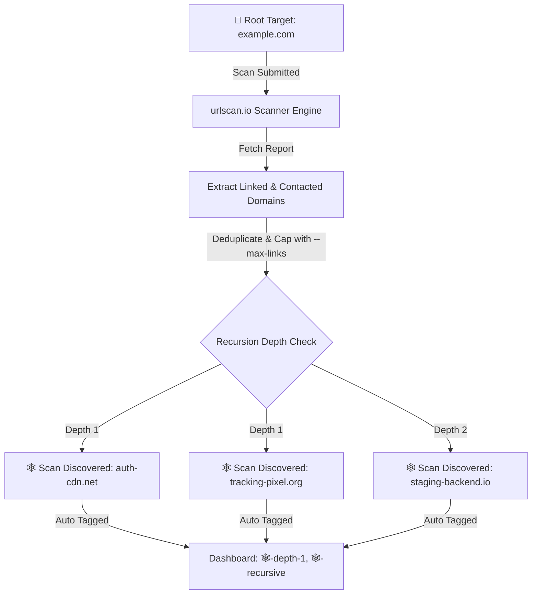
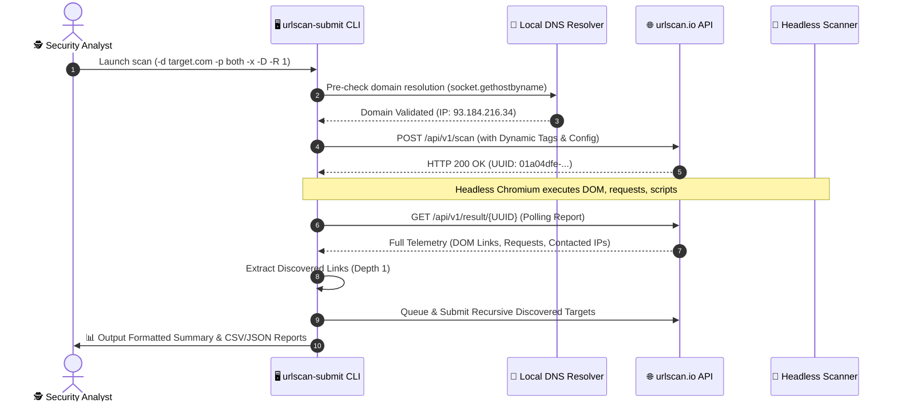

# 🔍 urlscan-submitter

<div align="center">

```text
 ____________________________________________________________________
/\                                                                   \
\_|  _   _ ____  _     ____   ____    _    _   _                     |_
  | | | | |  _ \| |   / ___| / ___|  / \  | \ | |   .--------------.  |
  | | | | | |_) | |   \___ \| |     / _ \ |  \| |   |  URLSCAN.IO  |  |
  | | |_| |  _ <| |___ ___) | |___ / ___ \| |\  |   |  SUBMITTER   |  |
  |  \___/|_| \_\_____|____/ \____/_/   \_\_| \_|   |  v1.2.0-2026 |  |
  |  ____  _   _ ____  __  __ ___ _____ _____ _____ '--------------'  |
  | / ___|| | | | __ )|  \/  |_ _|_   _|_   _| ____|  _ \             |
  | \___ \| | | |  _ \| |\/| || |  | |   | | |  _| | |_) |            |
  |  ___) | |_| | |_) | |  | || |  | |   | | | |___|  _ <             |
  | |____/ \___/|____/|_|  |_|___| |_|   |_| |_____|_| \_\            |
  |                                                                   |
  |  --==[ Automated Reconnaissance & Threat Intel Submissions ]==--  |
  |  --==[ Multi-Threaded Engine :: Smart Rate-Limit Handling  ]==--  |
 _|                                                                   |_
/\____________________________________________________________________/\
\______________________________________________________________________/
```

### ⚡ Automated Threat Intelligence & Attack Surface Reconnaissance CLI ⚡

[](https://python.org)
[](https://urlscan.io)
[](https://github.com/deadjdona/urlscan.io-submitter)
[](https://github.com/deadjdona/urlscan.io-submitter)
[](LICENSE)
[](https://github.com/deadjdona/urlscan.io-submitter)

[](https://react.dev)
[](https://www.typescriptlang.org/)
[](https://vitejs.dev/)
[](https://tailwindcss.com/)
[](https://nodejs.org)

[✨ Features](#-key-features) • [🚀 Quick Start](#-quick-start) • [📖 CLI Cheat Sheet](#-cli-options--emoji-shortcuts) • [🕸️ Deep Recon](#-deep-recursive-recon-mode) • [🎯 Playbooks](#-cybersecurity-playbooks) • [⚙️ Architecture](#-architecture--workflow)

</div>

---

## 🌟 Overview

**`urlscan-submitter`** is an automated, zero-external-dependency Python command-line engine and modern React 19 web suite engineered for security teams, incident responders, SOC analysts, and threat intelligence researchers. It bridges the gap between raw domain asset inventories and the [urlscan.io](https://urlscan.io) threat analytics platform.

> [!TIP]
> **Zero Dependencies Required for CLI**: The Python CLI operates entirely on Python's built-in standard library (`urllib`, `concurrent.futures`, `socket`, `ipaddress`, `csv`, `json`). Simply clone and run!

---

## ✨ Key Features

| Feature | Description |
| :--- | :--- |
| 🕸️ **Deep Recursive Recon** | Automatically parses completed scan telemetry to extract linked/contacted domains & IPs, recursively following them up to $N$ levels deep (`-R`, `--recursive`). |
| 🧪 **Smart DNS Resolution Pre-Check** | Validates target domain existence locally before submitting (`-D`, `--dns-precheck`) and caches runtime HTTP 400 DNS errors to eliminate redundant submissions. |
| 🏷️ **Dynamic Multi-Tag Generator** | Contextually auto-generates 5+ rich emoji metadata tags for each submission (e.g. `🔒-https`, `🏷️-org`, `🎯-company.org`, `🏢-sub-api`, `🤖-urlscan-submit`). |
| 🗺️ **Cartesian Subdomain Matrix** | Expands target domains across HTTP/HTTPS, root/www, and +20 (`-x`), +60 (`-xx`), or +140 (`-xxx`) common infrastructure subdomains (`sso`, `k8s`, `grafana`, `db`). |
| 🔎 **Subdomain IP Resolution** | Resolves live DNS A-records for target subdomains and submits both the hostnames and their raw direct IP endpoints (`-I`, `--resolve-ips`). |
| ⚡ **Multi-Threaded ThreadPool** | High-concurrency worker dispatch engine (`-w`, `--workers`) with built-in thread safety and real-time visual progress HUD. |
| 🚦 **Smart Rate-Limit Backoff** | Dynamically parses `X-Rate-Limit-Reset-After` headers and applies exponential backoff algorithms to prevent quota bans or dropped requests. |
| 🌐 **Interactive Web Dashboard** | Full-stack React + Vite + Tailwind CSS GUI with live terminal telemetry, dataset splitting, partition manager, and playbook guides. |
| 📊 **SIEM & Pipeline Exports** | Directly dump full JSON response payloads (`-j`) or formatted CSV summaries (`-e`) for SIEM/SOAR ingestion and reporting. |
| 👻 **Stealth & Evasion Controls** | Customize scan visibility (`public`, `unlisted`, `private`), spoof HTTP `Referer`, supply custom `User-Agent`, or configure gateway country (`--country`). |

---

## 🚀 Quick Start

### 1. Installation

```bash
# Clone the repository
git clone https://github.com/deadjdona/urlscan.io-submitter.git
cd urlscan.io-submitter

# (Optional) Set up Python Virtual Environment
python -m venv venv
# Linux / macOS: source venv/bin/activate
# Windows: .\venv\Scripts\Activate.ps1

# Install CLI tool locally
pip install .
```

### 2. Configure API Key

`urlscan-submit` resolves authentication in this strict order:
1. 🔑 **CLI Parameter**: `--api-key-file <path>` / `-k <path>`
2. ⚙️ **Config File**: `-c <path>` (or `.urlscan-config.json` / `.urlscan-config.yaml`)
3. 🌐 **Environment Variable**: `export URLSCAN_API_KEY="your-key-here"`
4. 📄 **Local Text File**: `./api_key.txt`

---

## 📖 CLI Options & Emoji Shortcuts

Every parameter supports both standard GNU-style options and fast single-emoji flags:

```text
usage: urlscan-submit [-h] [-c FILE] [--country CC] [-d DOMAIN] [-D]
                      [--delay SECONDS] [-e FILE] [-f FILE] [-I] [-j FILE]
                      [-k FILE] [--max-links N] [-p {http,https,both}] [-r]
                      [-R DEPTH] [--referer URL] [-s {root,www,both}]
                      [-t TAGS] [-ua UA] [-v] [-V {public,unlisted,private}]
                      [-w N] [-wl FILE] [-x] [-xx] [-xxx]
```

### Complete Argument Reference (Alphabetical)

| Parameter | Emoji Flag | Value | Description |
| :--- | :---: | :---: | :--- |
| `-c`, `--config` | `-⚙` | `<FILE>` | Path to custom JSON/YAML configuration file |
| `--country` | `-🌍` | `<CC>` | 2-letter ISO country code scanner gateway (`us`, `de`, `jp`, `nl`) |
| `-d`, `--domain` | `-🎯` | `<DOMAIN>` | Single target domain, hostname, or IP address (`example.com` or `123.21.33.22`) |
| `-D`, `--dns-precheck` | `-🧪` | _flag_ | 🧪 Fast local DNS pre-check: skip unresolvable domains before submitting |
| `--delay` | `-🐢` | `<SECONDS>`| Intentional delay floor in seconds between worker dispatches (default: `0.0`) |
| `-e`, `--export-csv` | `-📊` | `<FILE>` | Export formatted scan summary report to CSV file |
| `-f`, `--file` | `-📁` | `<FILE>` | Path to line-delimited text file of target domains/IPs (supports `#` comments) |
| `-h`, `--help` | | _flag_ | Display comprehensive help message and ASCII art banner |
| `-I`, `--resolve-ips` | `-🔎` | _flag_ | Resolve DNS A-records for subdomains and submit direct IP endpoints |
| `-j`, `--json-log` | `-📜` | `<FILE>` | Export complete raw JSON API response payloads to file |
| `-k`, `--api-key-file`| `-🔑` | `<FILE>` | Path to file containing urlscan.io API key |
| `--max-links` | `-📎` | `<N>` | Max discovered linked domains to follow per recursive cycle (default: `10`) |
| `-p`, `--protocols` | `-🌐` | `http\|https\|both` | Protocol variants to generate (default: `https`) |
| `-r`, `--report` | `-📝` | _flag_ | Wait for scan completion and print formatted ASCII summary table |
| `-R`, `--recursive` | `-🕸` | `<DEPTH>` | Recursion depth to follow and scan discovered linked domains (`-R 1`, `-R 2`) |
| `--referer` | `-🔗` | `<URL>` | Override HTTP `Referer` header sent by urlscan.io crawler |
| `-s`, `--subdomains` | `-🏢` | `root\|www\|both` | Subdomain prefix generation mode (default: `root`) |
| `-t`, `--tags` | `-🏷` | `<TAGS>` | Comma-separated custom tags (e.g. `phishing,incident-99`) |
| `-ua`, `--user-agent` | `-🤖` | `<UA>` | Override default User-Agent browser string |
| `-v`, `--verbose` | `-🔊` | _flag_ | Enable verbose HTTP request/response debugging output |
| `-V`, `--visibility` | `-👻` | `public\|unlisted\|private` | Scan visibility on urlscan.io dashboard (default: `public`) |
| `-w`, `--workers` | `-🚀` | `<N>` | Number of concurrent worker threads (default: `1`) |
| `-wl`, `--wordlist` | `-📖` | `<FILE>` | Path to custom subdomain list for Cartesian matrix expansion |
| `-x`, `--explore` | `-🔍` | _flag_ | Enumerate **+20 common subdomains** (`admin`, `api`, `mail`, `dev`, etc.) |
| `-xx`, `--deep-explore` | `-🤿` | _flag_ | Enumerate **+60 deep subdomains** (`auth`, `sso`, `git`, `k8s`, `vpn`, etc.) |
| `-xxx`, `--massive-explore`| `-🌌` | _flag_ | Enumerate **+140 massive subdomains** (`cloud`, `db`, `grafana`, `vault`, etc.) |

---

## 🕸️ Deep Recursive Recon Mode

Discovered links in web pages are primary pathways for finding phishing landing pages, staging domains, and connected shadow infrastructure. `urlscan-submitter` includes a built-in recursive crawler engine.



### Recursive Examples

```bash
# 🕸️ Scan target and follow discovered links 1 level deep:
urlscan-submit -🎯 example.com -🕸 1

# 🕸️ Deep 2-level recursive crawl capping discovered domains to 5 per scan:
urlscan-submit -d target.com -R 2 --max-links 5

# 🕸️ Combine with Cartesian subdomain matrix and CSV export:
urlscan-submit -d target.com -p both -s both -x -R 1 -e recursive_report.csv
```

---

## 🎯 Cybersecurity Playbooks

### 🛡️ 1. Attack Surface Perimeter Discovery
Expands 140+ subdomains, both HTTP & HTTPS, resolves live IPs, and dumps to JSON:
```bash
urlscan-submit -d target.com -p both -s both -xxx -I -j attack_surface.json
```

### 🕵️ 2. Phishing Incident Triage & Link Extraction
Unlisted scan with referral spoofing, automated tags, and recursive crawl:
```bash
urlscan-submit -d suspicious-portal.net -V unlisted -R 1 -e triage_report.csv \
  --tags "incident-404,phishing-triage" --referer "https://outlook.office.com/"
```

### 🚀 3. High-Speed Threat List Ingestion
Submits 1,000+ domains with 10 threads, DNS pre-checking, and rate backoff:
```bash
urlscan-submit -f threat_domains.txt -w 10 -D -e bulk_results.csv
```

### 👻 4. Stealth Reconnaissance Sweep
Private team visibility, scanner gateway in Germany, and 2.5s jitter delay:
```bash
urlscan-submit -d confidential-target.com -V private --country de --delay 2.5 -r
```

---

## 🏷️ Smart Auto-Tagging Matrix

Each submission automatically receives **5+ rich metadata tags** with emojis, making filtering and triage effortless in your urlscan.io workspace:

```text
Target: https://api.internal.bank.co.uk (via massive recon from file targets.txt)
Generated Tags:
├── 🔒-https                (Transport Security Scheme)
├── 🏷️-uk                   (Top Level Domain)
├── 🎯-bank.co.uk           (Apex Organization Domain)
├── 🏢-sub-api              (Subdomain Function Identifier)
├── 🌌-massive-recon        (Reconnaissance Mode)
├── 📁-targets              (Source Dataset File)
└── 🤖-urlscan-submit       (Automation Engine Signature)
```

---

## 🌐 Web Dashboard (React + Express)

For teams preferring a visual interface, `urlscan-submitter` includes a responsive web application:

```bash
# Start Vite Development Server
npm install
npm run dev

# Or build for production deployment
npm run build
npm run server  # Serves on port 3001
```

<div align="center">

| UI Feature | Functionality |
| :--- | :--- |
| **🚀 Live Scanner HUD** | Interactive parameter matrix builder with real-time SSE execution logs |
| **📈 Dataset Profiler** | Instant domain file ingestion, syntax validation, and chunk partitioning |
| **📜 Playbooks & Cheatsheet** | Ready-to-copy terminal commands for common red team and SOC workflows |
| **🎨 Cyber Aesthetics** | Terminal dark mode, responsive layout, and real-time status gauges |

</div>

---

## ⚙️ Architecture & Workflow



---

## 🧪 Test Suite & Continuous Verification

The project is tested using Python's `unittest` framework with **100% test pass rate** across all parameter combinations:

```bash
# Run unit & integration test suite
python -m unittest discover tests/

# Measure code coverage
python -m coverage run --source=urlscan_submit -m unittest discover tests/
python -m coverage report -m
```

```text
----------------------------------------------------------------------
Ran 70 tests in 0.926s

OK
Coverage: 96%
```

---

## 📄 License

This project is open source and released under the [MIT License](LICENSE).

<div align="center">

**Built with 💙 for the Threat Intelligence & Cybersecurity Community**

</div>
